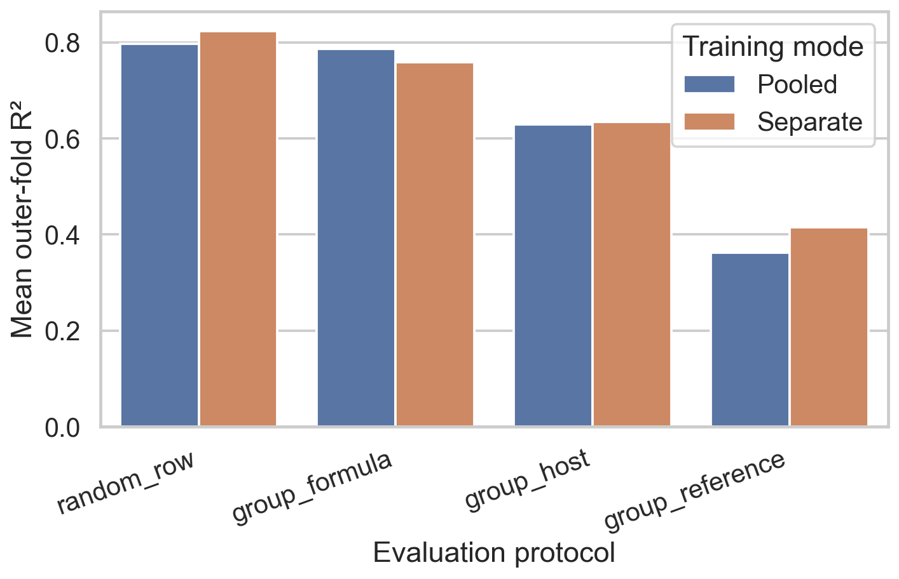
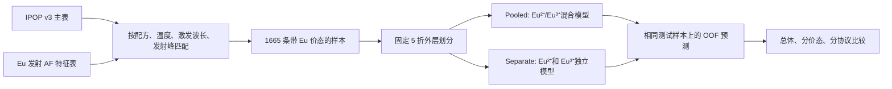
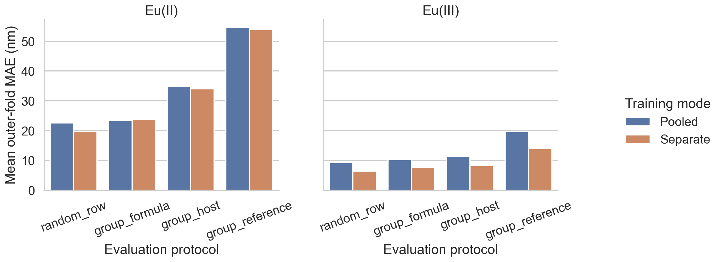

# IPOP Eu 发射波长预测的复现与扩展研究

[](https://github.com/silverlight001/ipop-eu-valence-reproduction/actions/workflows/ci.yml)
[](https://www.python.org/)
[](https://doi.org/10.6084/m9.figshare.24771186.v1)
[](https://doi.org/10.1038/s41598-024-58351-w)

> Reproducible machine-learning study of Eu-activated inorganic phosphors, with split-aware evaluation and an explicit Eu(II)/Eu(III) comparison.

本项目复现 Jang 等人 2024 年发表于 *Scientific Reports* 的 IPOP 无机荧光粉数据集发射波长模型，并在相同公开数据基础上开展可复现的扩展研究，重点回答三个问题：

1. 在原论文未公开精确随机划分和全部训练细节的条件下，能否复现其主要建模流程和性能量级？
2. 随机行划分与按配方、host 或来源文献分组的划分，会怎样影响性能判断？
3. 原论文将 Eu²⁺与 Eu³⁺混合训练；显式区分价态后，预测结果如何变化？

项目公开完整代码、固定数据版本、校验哈希、数据处理结果、折划分、逐样本预测、超参数、指标表、图表和中文讨论，目标是让其他研究者可以直接审查、复跑和扩展。

## 核心结论

### 本项目已经验证的结果

- `random_row` 没有重复分配同一个 `row_id`，但没有隔离相关观测。在本次固定五折划分中，训练集和测试集之间单折最多重叠 55 个 Formula、93 个 Host 和 160 个 Reference。这构成分组信息或来源信息泄漏的风险，可能使随机划分的性能估计偏乐观；对应的分组协议则将各自强制隔离键的重叠降为 0。
- 从 `random_row` 到 `group_reference`，XGBoost 的 R²由 0.797 降至 0.362，MAE由 14.267 nm 增至 32.822 nm。随机行划分的高分主要反映已见数据分布附近的插值能力，不能直接代表新 host 发现或跨文献迁移能力。
- IPOP 主表明确提供 `1st dopant valency` 和 `2nd dopant valency`；价态并非根据发射峰或化学式推断。1665 条 Eu 发射样本全部成功回连价态，其中 Eu²⁺ 626 条、Eu³⁺ 1039 条，无缺失或冲突。
- Eu²⁺与 Eu³⁺对应不同的电子跃迁机制，不应在未经检验的情况下视为同一均质学习任务。分价态训练在四种评估协议中均降低总体 MAE，改善 1.415–3.765 nm。
- 分价态训练并非对所有指标和子群都更优：R²在 `random_row`、`group_host` 和 `group_reference` 中提高，但在 `group_formula` 中从 0.786 降至 0.759；Eu²⁺在 `group_formula` 下的 MAE增加 0.384 nm。

### 当前尚未解决的问题

- 现有模型只使用组成统计和实验条件，没有显式表示晶体结构、Eu 的局域配位、晶场环境和具体掺杂位点。
- 将完整发射光谱压缩为单个峰值波长，丢失了带宽、峰形、非对称性、多峰结构和颜色质量等信息。
- 寿命、量子效率和热猝灭尚未纳入本轮价态比较；其中寿命也不应默认简化为单一主时间常数。
- 当前没有样本级预测不确定性；折间标准差只描述评估结果的稳定性，不能替代预测区间。
- `separate` 使用两个独立调参模型，观察到的收益同时包含价态区分和模型容量增加。后续仍需增加 `pooled + valence indicator` 对照。

这些未解决问题是当前结论的适用边界和后续扩展方向，不应被表述为本轮实验已经验证的改进效果。



## 为什么这个问题重要

Eu²⁺和 Eu³⁺的发光机制存在本质差异。Eu²⁺通常表现为允许的 5d→4f 跃迁，对晶场和局域配位高度敏感；Eu³⁺主要表现为 4f→4f 跃迁。将二者合并为一个统计学习任务，可能迫使模型同时拟合两个不同的结构—性质关系。

原论文为了保留样本量，将所有 Eu 激活样本合并训练。该选择适合作为初步基线，但也留下了一个清晰、可验证的科学问题：在相同数据和相同外层测试折上，价态专属模型是否优于混合模型？

这个项目的价值不只是提高一个 R²，而是建立一套更可信的材料机器学习比较方法：

- 固定公开数据版本和哈希，确保输入可追溯；
- 保留逐样本预测与折分配，方便检查数据泄漏；
- 同时报告随机插值和材料/文献外推性能；
- 对总体结果和 Eu²⁺/Eu³⁺子群分别报告；
- 明确记录负结果、例外和尚未解决的限制。

## 数据概况

原始 IPOP v3 数据集包含：

| 项目 | 数量 |
| --- | ---: |
| 无机荧光粉组合 | 3952 |
| Host | 2238 |
| Dopant 元素 | 21 |
| 来源文献 | 553 |
| 光学性质观测 | 16023 |
| 本项目 Eu 发射样本 | 1665 |
| Eu²⁺样本 | 626 |
| Eu³⁺样本 | 1039 |

本仓库固定使用 Figshare v1：[`10.6084/m9.figshare.24771186.v1`](https://doi.org/10.6084/m9.figshare.24771186.v1)。原始数据由 IPOP 作者以 CC BY 4.0 发布。详情、字段、哈希和派生文件关系见 [数据说明](docs/DATA.md) 与 [第三方数据声明](THIRD_PARTY_DATA.md)。

## 实验设计



### 输入与目标

- 目标：最大 PL 发射波长 `Emission max. (nm)`。
- 原子特征：52 个组成统计特征，包括原子序数、原子量、原子半径、电负性、价电子数和第一电离能等。
- 测量条件：温度 `Temp. (K)` 与激发波长 `Excitation source (nm)`。
- 主结果特征集：`AF+T+ES`。
- 模型：XGBoost；中位数回归作为基线。

### 评估协议

所有实验固定 seed 42，采用 5 折外层评估和 3 折内层超参数选择。

| 协议 | 测试问题 | 强制隔离键 |
| --- | --- | --- |
| `random_row` | 同分布随机插值能力 | 无 |
| `group_formula` | 面对未见完整配方 | Formula |
| `group_host` | 面对未见 host 字符串 | Host |
| `group_reference` | 跨来源文献迁移 | Reference/DOI |

三种分组协议都经过训练集—测试集重叠检查，强制键最大重叠数为 0。完整方法见 [方法说明](docs/METHODOLOGY.md)。

## 主要结果

下表为 `AF+T+ES / XGBoost` 的五个外层折均值。括号中的波动可在公开 CSV 中查看；这里突出平均效果。

| 协议 | 混合 R² | 分价态 R² | ΔR² | 混合 MAE (nm) | 分价态 MAE (nm) | MAE 改善 (nm) |
| --- | ---: | ---: | ---: | ---: | ---: | ---: |
| `random_row` | 0.797 | 0.823 | +0.027 | 14.267 | 11.490 | +2.777 |
| `group_formula` | 0.786 | 0.759 | −0.027 | 15.211 | 13.796 | +1.415 |
| `group_host` | 0.629 | 0.634 | +0.006 | 20.255 | 18.030 | +2.225 |
| `group_reference` | 0.362 | 0.415 | +0.052 | 32.822 | 29.057 | +3.765 |

定义：`ΔR² = separate − pooled`；`MAE 改善 = pooled − separate`，正值表示分价态方案更好。



完整结果与讨论见：

- [总体最终结果 CSV](outputs/emission-valence-comparison/final_results.csv)
- [Eu²⁺/Eu³⁺分层结果 CSV](outputs/emission-valence-comparison/final_results_by_valence.csv)
- [完整结果与讨论](docs/RESULTS.md)
- [自动生成的中文发现](outputs/emission-valence-comparison/findings_zh.md)

## 如何理解这些结果

价态区分总体上降低了绝对误差，特别是在跨文献评估中。然而，这不等于“价态区分必然提升所有指标”：

- `group_formula` 的总体 MAE下降，但 R²下降且折间波动增大。
- Eu²⁺在 `group_formula` 中略有退化，说明较小的数据量和更强的配方外推可能抵消分组收益。
- Eu³⁺在 `group_reference` 中改善最大，但其混合模型 R²为负，分价态后仍接近 0；这表明跨文献迁移仍然困难。
- `separate` 使用两个独立调参模型，因此收益同时包含价态信息和模型容量增加。它不是“增加一个价态特征”的纯因果估计。

因此，本项目支持的结论是：**Eu 价态是不可忽略的建模变量，价态专属模型能改善总体 MAE，但效果依赖具体价态与外推场景。**

## 可复现运行

需要 Python 3.11 或更高版本。

```bash
python -m venv .venv
```

Windows PowerShell：

```powershell
.\.venv\Scripts\Activate.ps1
```

macOS/Linux：

```bash
source .venv/bin/activate
```

安装依赖：

```bash
python -m pip install -e ".[dev]"
```

运行基线复现与分组评估：

```bash
python -m ipop all
```

运行完整价态比较：

```bash
python -m ipop all-valence
```

如果已经准备好数据，也可以分步运行：

```bash
python -m ipop validate
python -m ipop prepare-emission
python -m ipop run-valence
python -m ipop report-valence
```

更详细的环境、工件和验证步骤见 [复现指南](docs/REPRODUCIBILITY.md)。

## 仓库结构

```text
.
├── configs/                         固定实验配置
├── data/
│   ├── manifests/                   来源 URL、大小与哈希
│   ├── raw/                         IPOP 原始 CSV（CC BY 4.0）
│   └── interim/                     校验、匹配和带价态数据
├── docs/                            数据、方法、结果和复现说明
├── outputs/
│   └── emission-valence-comparison/完整训练结果与逐样本预测
├── src/ipop/                        数据、划分、建模、报告代码
├── tests/                           自动化测试
├── CITATION.cff                     本项目引用元数据
└── pyproject.toml                   Python 依赖与工具配置
```

## 质量控制与验证

- 102 个自动化测试通过。
- `ruff` 静态检查通过。
- 新实验的 pooled 预测与旧基线 53,232 条预测逐值完全一致。
- 价态实验共公开 106,464 条逐样本预测，两种模式各 53,232 条。
- pooled/separate 的 `row_id`、外层折、价态和真实值逐行配对一致。
- 三种强制分组协议的测试键重叠均为 0。
- 失败重跑会留下 `.incomplete` 标记并清除陈旧结果，报告器拒绝读取不完整实验。

## 当前限制

1. 只使用组成统计和测量条件，没有显式晶体结构、局域配位或掺杂位点。
2. 将完整发射光谱压缩为单个峰值，无法描述带宽、非对称性、多峰和颜色质量。
3. 寿命、量子效率和热猝灭尚未纳入本轮价态比较。
4. 没有样本级 uncertainty；折间标准差不能替代预测区间。
5. 文献数据存在发表偏倚、实验室差异和潜在标签误差。
6. `Host` 和 `Formula` 是字符串分组，不能保证化学家族完全独立。
7. 两个独立模型的比较同时改变价态分组与总模型容量。

## 未来计划

优先级从高到低：

1. 增加 `pooled + valence indicator` 对照，分离价态信息与模型容量效应。
2. 使用 conformal prediction、分位数模型或深度集成提供校准 uncertainty。
3. 通过 MP-ID/ICSD-ID 引入晶体结构，并构建结构图神经网络基线。
4. 从原始文献补充稀土占位、局域配位和电荷补偿信息。
5. 将目标从单峰扩展到完整光谱表示或光谱参数集合。
6. 对寿命采用多指数/分布式表示，而不是单一主时间常数。
7. 增加时间外推、材料家族外推和独立实验验证集。

## 引用

如果使用本仓库，请同时引用原论文和数据集：

> Jang, S., Na, G. S., Choi, Y. & Chang, H. Optical property dataset of inorganic phosphor. *Scientific Reports* **14**, 7639 (2024). https://doi.org/10.1038/s41598-024-58351-w

> Jang, S. Optical property dataset of inorganic phosphor (IPOP dataset ver. 3.0, 20231208). figshare (2023). https://doi.org/10.6084/m9.figshare.24771186.v1

本项目的机器可读引用信息见 [`CITATION.cff`](CITATION.cff)。

## 许可与归属

- IPOP 原始数据由原作者以 **CC BY 4.0** 发布，版权与署名要求归原作者所有。
- 本仓库中的数据副本、派生文件与来源关系见 [`THIRD_PARTY_DATA.md`](THIRD_PARTY_DATA.md)。
- 本仓库代码目前未附加独立开源许可证；公开可见不等同于授予额外的软件使用许可。

## 免责声明

本项目是基于公开数据的方法级复现与扩展研究，不声称逐小数位重现原论文未公开的随机划分或平台内部细节。模型结果不能替代材料合成、结构表征、光谱测量或专业判断。
